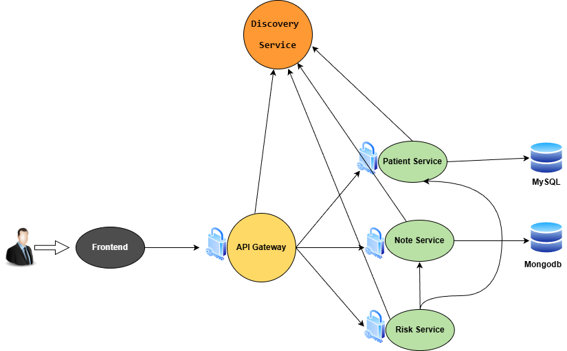

# MedilaboSolutions

Medilabo est une application médicale. Elle permet aux utilisateurs (médecins) 
d’ajouter des patients et de mettre à jour leurs informations personnelles. 
En tant que médecin, il est également possible d’ajouter des notes médicales pour chaque 
patient et de les consulter. En fonction du sexe du patient, de son âge et du nombre de termes 
déclencheurs présents dans les notes médicales, une estimation du risque de développer 
le diabète est calculée et affichée sur la page d’informations du patient.

## Technologies

* Java 21
* Mysql 8.0.42
* MongoDb 
* Docker
* IDE Intellij

## Architecture l'application

## Le Green Code
#### Comment appliquer le Green Code dans ce projet

1. Optimiser la gestion des notes et des patients

* Stocker les résultats de calcul plutôt que de recalculer à chaque requête.

* Supprimer ou mettre à jour uniquement les informations nécessaires.

* Réécrire les algorithmes en versions plus légères et performantes.

* Réduire la duplication et simplifier les fonctions complexes.

2. Optimiser le calcul des risques

* Stocker le niveau de risque d’un patient au lieu de recalculer systématiquement toutes les données à chaque consultation.

* Recalculer uniquement lorsque de nouvelles informations ou notes sont ajoutées.

3. Limiter les données affichées

* Ne pas afficher toutes les informations d’un patient sur une seule page, afin de réduire le transfert et le rendu de données inutiles.

4. Optimisation générale

* Mettre en place un microservice de registre et de découverte (Eureka) pour optimiser la communication entre les services.
